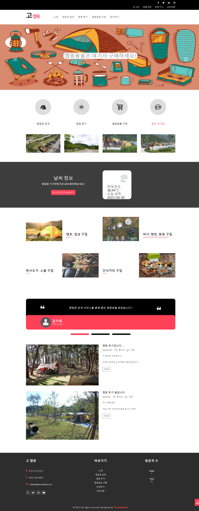
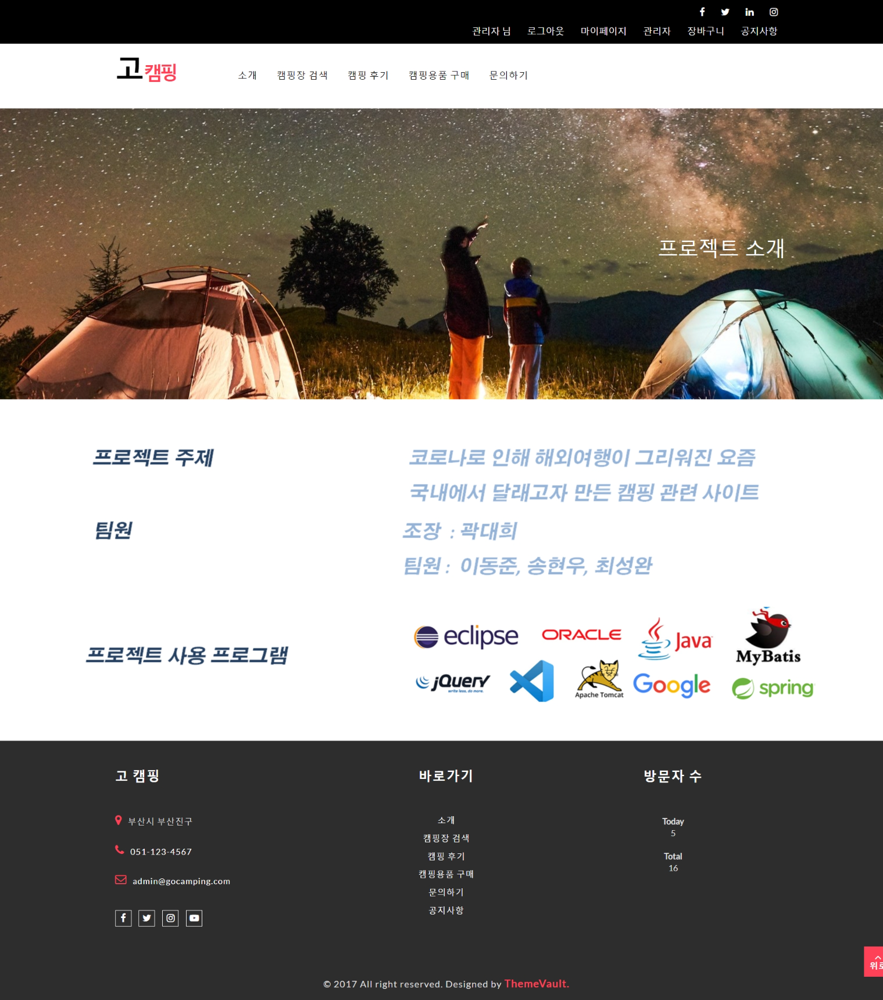
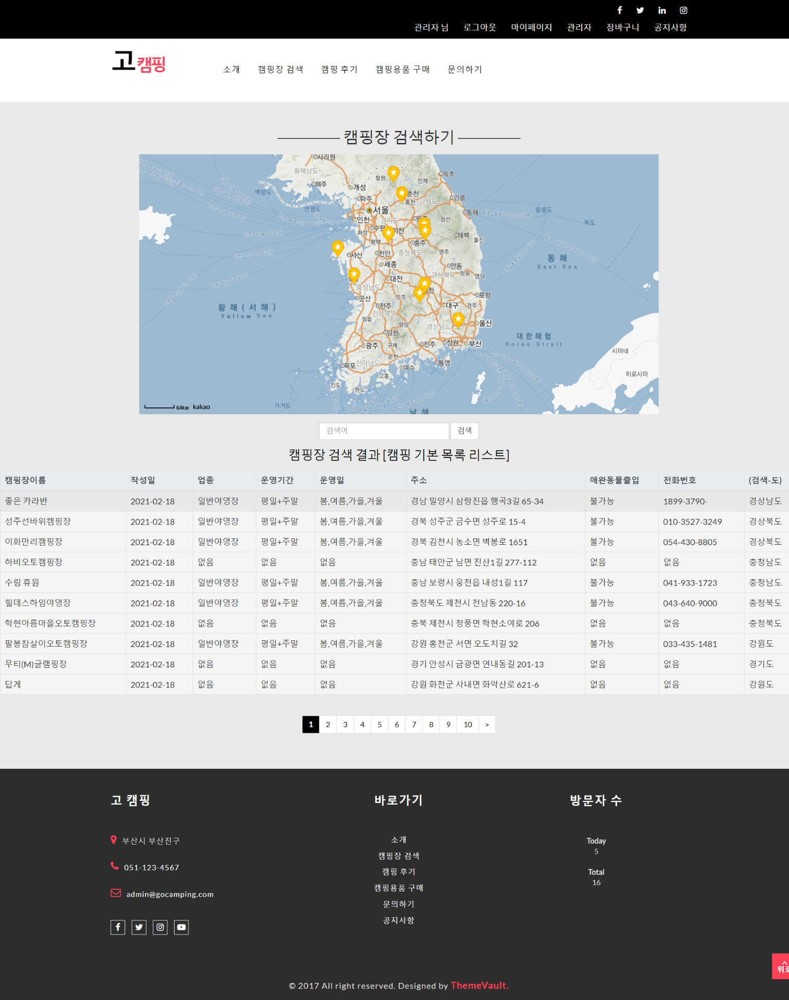
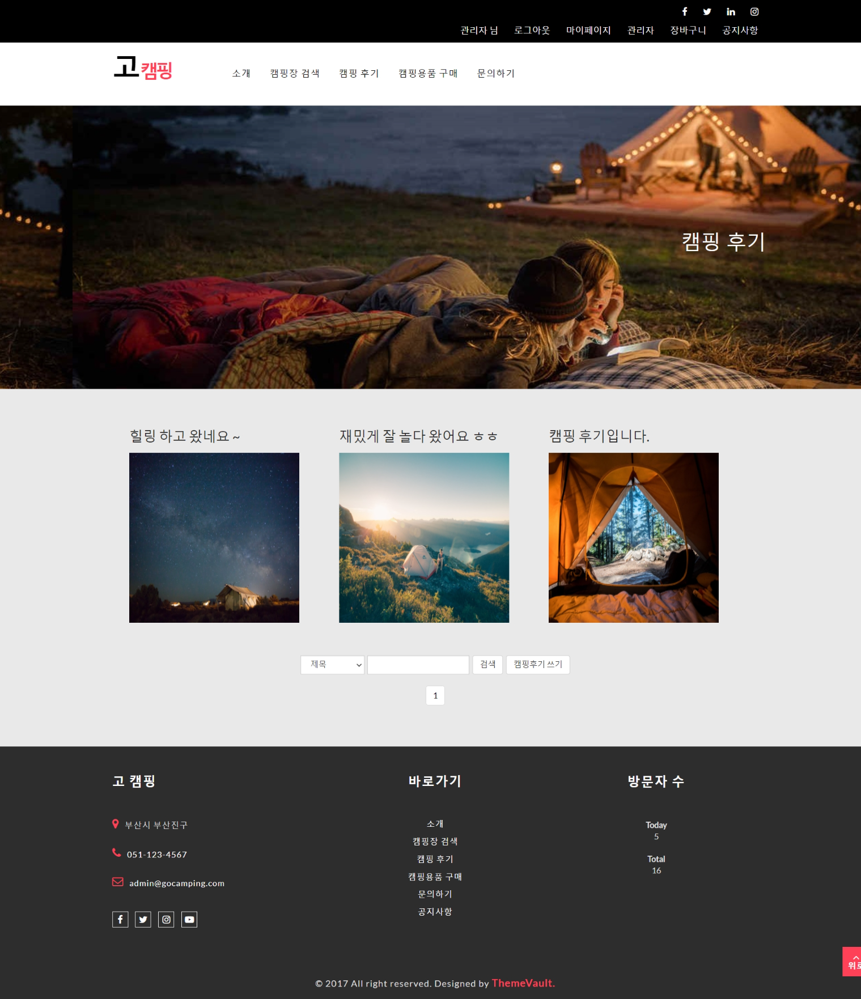
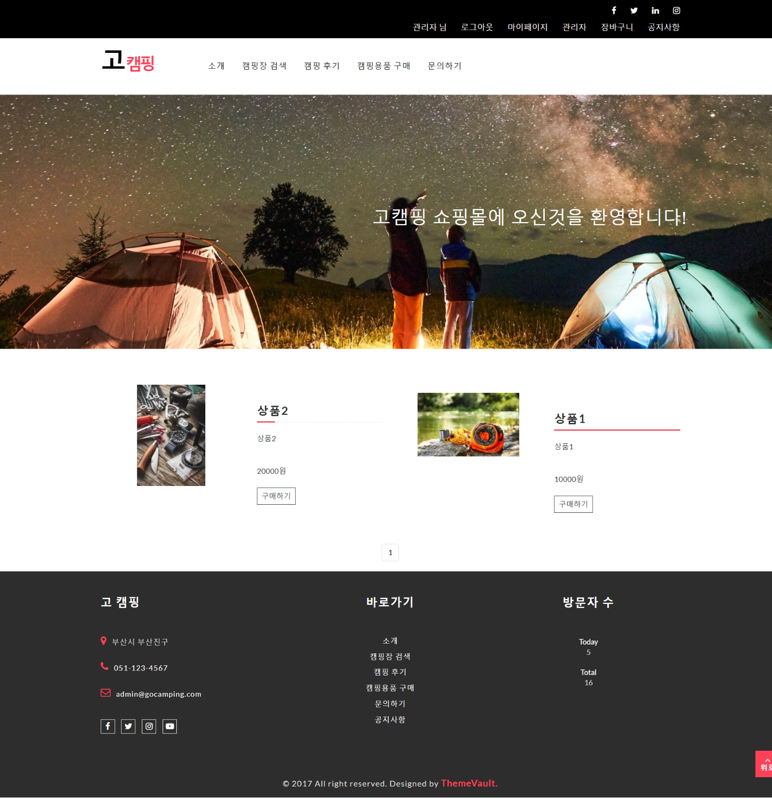
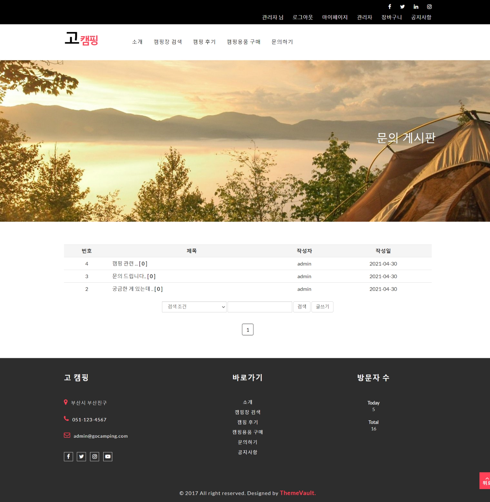
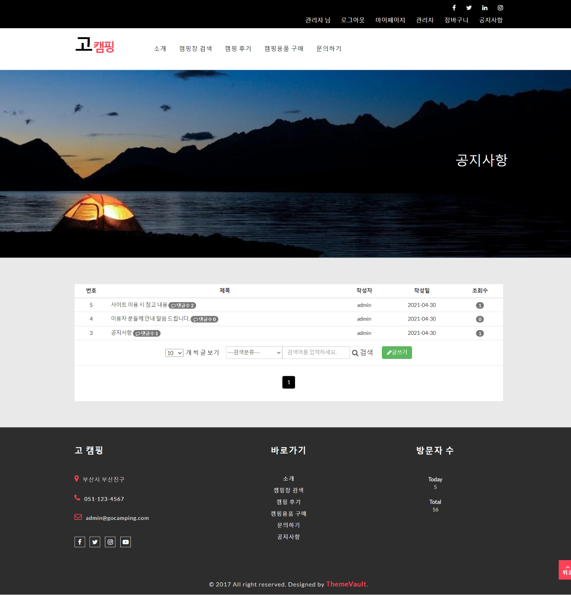

# Spring 프로젝트

## 팀 (가나다 순)
- 곽대희: 팀장, 프로젝트 디자인, 문의 게시판
- 송현우: 캠핑 후기 게시판, 캠핑용품 구매 관련 장바구니 기능, 소개 페이지
- 이동준: 회원 기능, 관리자 기능, 캠핑용품 구매 관련 상품 관리 기능
- 최성완: 캠핑장 검색 기능, 공지사항 게시판, 방문자 수 카운트 기능, 현재위치 날씨 조회 기능

## 프로젝트
- 캠핑장 검색, 캠핑 후기 공유, 캠핑용품 구매 등이 가능한 캠핑 관련 커뮤니티; 고캠핑(GoCamping)
- Spring, MyBatis 프레임워크, Lombok 라이브러리 및 다양한 라이브러리를 이용하여 웹 사이트 제작

## 제작기간
2021-04-08 ~ 2021-05-02

## 제작 환경
- SDK: Oracle JDK 1.8 // Java
- IDE: Eclipse 2019-06
- DBMS Client: SQL Developer
- DBMS Server: Oracle Database 11g Express Edition
- WS & WAS: Apache & Tomcat 9
- Library & Framework : Spring, MyBatis, Lombok 등

## 실행화면

